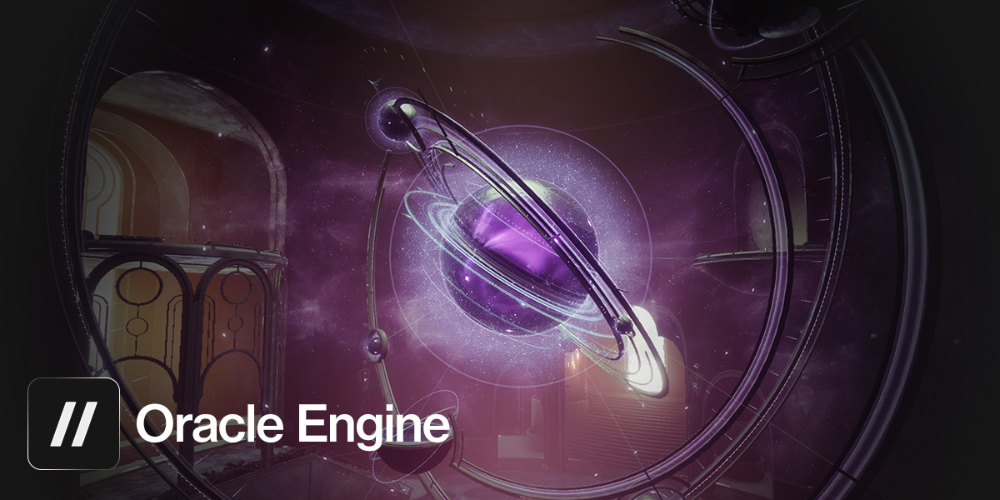

  

Oracle Engine is [Foundry](https://d2foundry.gg)'s Rust and WebAssembly based Destiny 2 calculation API, originally forked from the [D2 Calculation API](https://github.com/D2-Insight/D2_Calculation_API).

## Contributing

Please see our CONTRIBUTING.md.
